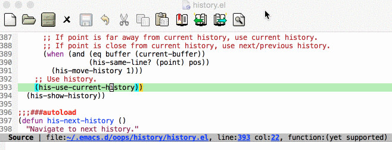
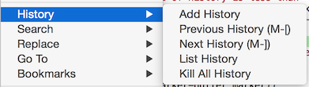
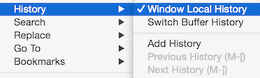
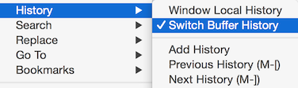

[](http://melpa.org/#/history)
[](https://travis-ci.org/boyw165/history)

history.el - History Utility For Code Navigation
================================================

This tool is similar to `pop-global-mark` but more powerful.
You can go through the whole history without losing them. Actually, `pop-global-mark` will use the latest record but also discard it. But this tool will preserve all the history and smartly ignore killed buffers or invalid symbol string.

You'll feel the power and convenience of using `history-add-history`, `history-prev-history` and `history-next-history` instead of built-in old way.

Demo
----


Basic Concept - Linked List Liked
---------------------------------
* Normal history database:

```
  (1) - (2) - (3) - (4) - (5)
                           ^ index
```

* Goto previous Nth history:

```
  (1) - (2) - (3) - (4) - (5)
               ^ index
```

* Add a new history into the database:

```
  (1) - (2) - (3) - (6)
                     ^ index, histories behind index will be discard,
                       and new one will be appended to the end.
```

Usage
-----
* `M-x history-mode` Add menu items and tool-bar items of history utility.




* `(history-add-history)` Save current point and buffer as a history into the database.

* `(history-add-history t)` Like above, but also save symbol string at point. When navigating to the history, the tool compare the matched string so that it makes sure the history is VALID.

* `M-x history-prev-history` Goto previous history.

* `M-x history-next-history` Goto new history.

* `M-x history-kill-histories` Discard whole history database.

* `M-x history-goto-history` Enter history preview mode. `ENTER` to confirm to use the selected history. `ESC` to cancel preview and restore everything.


Customization
-------------
* `history-history-max` The maximum length of the history database.

* `history-ignore-buffer-names` A REGEXP list to ignore specific buffers.

* `history-window-local-history` To toggle using **window-local** or **global** history. **Window-local history means every window has its independent history database.**



* `history-switch-buffer-history` Whether to add history when switching buffer.



Contribution
------------
Forks and pull requests are welcome!
